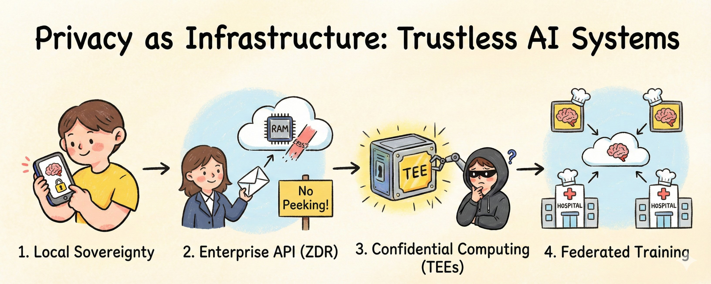
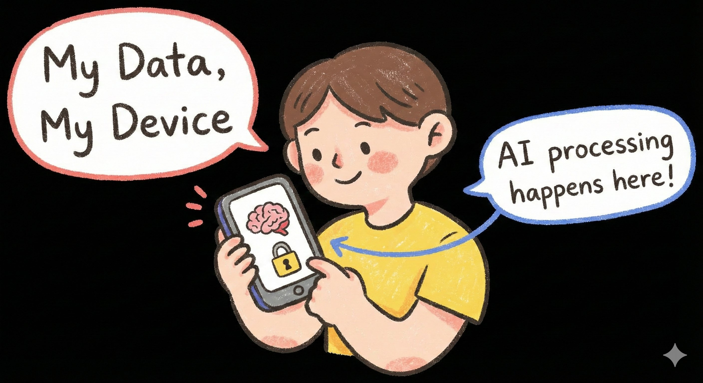
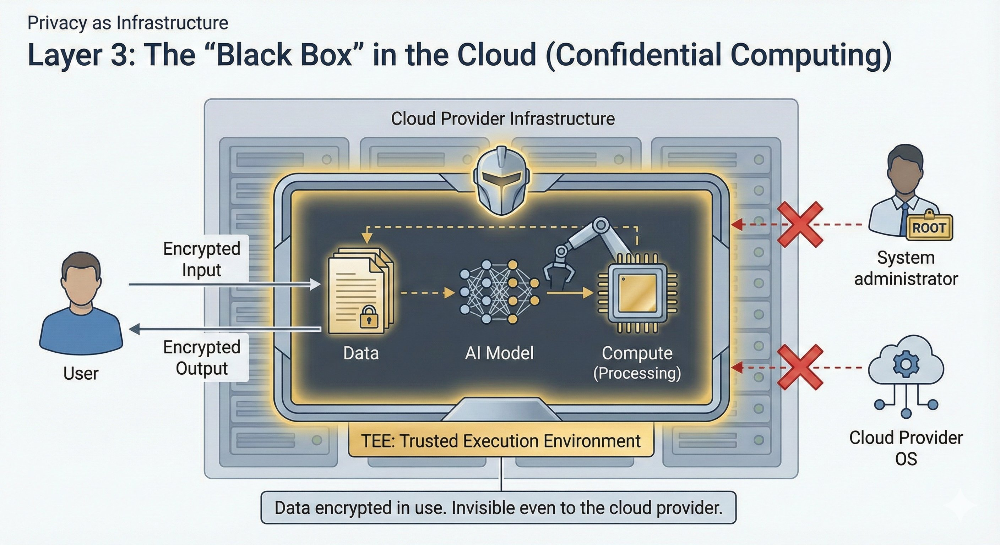
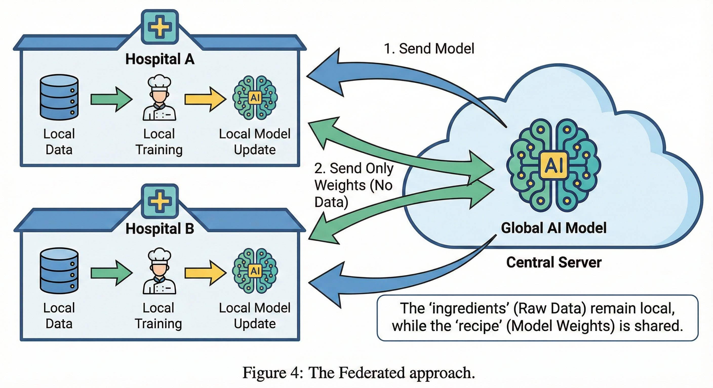

# Privacy as Infrastructure: Trustless AI Systems

[ ](https://x.com/PromiseGameFi/article/2001266197115851233/media/2001252106699702272)Large Language Models (LLMs) have grown quickly and created a privacy gap. We need to balance using these tools with keeping control of our data. This report looks at new technologies that address this issue. We call this "Privacy as Infrastructure." This means we use software and hardware to protect data automatically.

### 1. Introduction: The Privacy Gap

Most Artificial Intelligence (AI) systems today are centralized. Users send sensitive data to a central server to be processed and stored. This creates a risk for businesses and individuals who care about privacy, as the data is exposed as soon as it leaves the user's device.

A new method called Privacy as Infrastructure is emerging. This approach does not rely on terms of service contracts. It uses cryptography and secure hardware to keep data safe during use and transport. We can break this infrastructure down into four layers.

### 2. Layer 1: User Sovereignty and Local Inference

The first layer of defense is keeping data local. If data stays on the device, then it is much safer.

2.1 Edge IntelligenceRunning powerful AI models used to require large cloud servers. New tools like Ollama and LM Studio have made it easier to run these models on personal computers. Users can now run models like Llama 3 or Mistral directly on their laptops.

2.2 The Private Cloud in Your PocketIn this model, the user downloads the AI model to their device and disconnects from the internet.

* Ollama allows developers to write code for private interactions.
* LM Studio provides a simple visual interface for chatting with AI completely offline.

This solves privacy for the individual user. However, we must use the cloud to access larger, smarter AI models, and not everyone can run models locally.

### 3. Layer 2: The Enterprise API and Zero Data Retention

Businesses often need massive models like GPT-4 or Claude 3.5. These models are too big to run locally. Privacy in this layer relies on contracts called Zero Data Retention (ZDR).&#x20;

3.1 The Stateless ConversationProviders like OpenAI and Anthropic offer special business connections where they agree not to train their AI on customer data.

* Azure OpenAI Service places the AI model inside a private network for the customer.
* Zero Data Retention means the system deletes inputs and outputs immediately after processing.

This is useful for following laws like GDPR or HIPAA. However, it still requires trusting the provider not to look at the data. To remove the need for trust, we need hardware guarantees.

### 4. Layer 3: Confidential Computing

This layer protects data while the computer is actively using it.

4.1 Trusted Execution Environments (TEEs)Data is usually encrypted when it is stored or moving over the internet. However, computers typically must decrypt data to process it. This moment of decryption creates a vulnerability.

&#x20;   A Trusted Execution Environment (TEE) is a secure area inside a computer processor. Examples include Intel TDX or Nvidia H100 GPUs. This secure area is invisible to the cloud provider. The cloud provider manages the computer, but cannot see what is happening inside the secure area.

4.2 Decentralized Physical InfrastructureNew blockchain projects use this technology to build decentralized AI clouds.

* Phala Network uses TEEs to let AI agents run code without the operator seeing the data.
* Oasis Network uses confidential systems to manage private data for AI.
* Secret Network allows smart contracts to use encrypted data that no one can see.

### 5. Layer 4: The Training Layer

The final challenge is training AI models on sensitive data without sharing the raw information.

5.1 Federated LearningIn centralized training, all data is sent to one server. Federated Learning sends the AI model to the data instead.

A central system sends a basic model to many different users. Each user improves the model on their own device using their own data. They send only the improvements back to the central system. The central system never sees the raw data.

5.2 Differential PrivacyResearchers use Differential Privacy to ensure the model updates do not reveal secret information. This method adds mathematical noise to the data, allowing the system to learn general patterns without recording specific details about any single individual.

5.3 Homomorphic EncryptionThis technology allows computers to compute data while it remains encrypted. The system processes the data without ever unlocking it.

### 6. Strategic Implications

These technologies are creating a new standard for the AI economy.

1. Commoditization of Trust: Secure hardware like TEEs will make private computing a standard feature.
2. Decentralized Networks: Networks like Phala and Akash can offer this infrastructure securely because they can cryptographically prove their hardware is safe.
3. Regulatory Compliance: Laws like the EU AI Act will make these zero-knowledge architectures necessary.

We are entering the era of "Trustless AI," where data confidentiality is mathematically enforced.
