# X402

## What is X402?

**In Simple Terms:** X402 is like a "pay-per-use" vending machine for the internet. Instead of subscribing to services or creating accounts, you pay small amounts (micropayments) instantly to access what you need - like paying for a single API call, reading one article, or getting one piece of data.

**Technical Definition:** X402 is an open-source, chain-agnostic payment protocol built on top of HTTP that activates the long-dormant HTTP status code **402 "Payment Required"** to enable instant, frictionless payments for web resources using blockchain technology (primarily stablecoins like USDC).

### Visual Overview

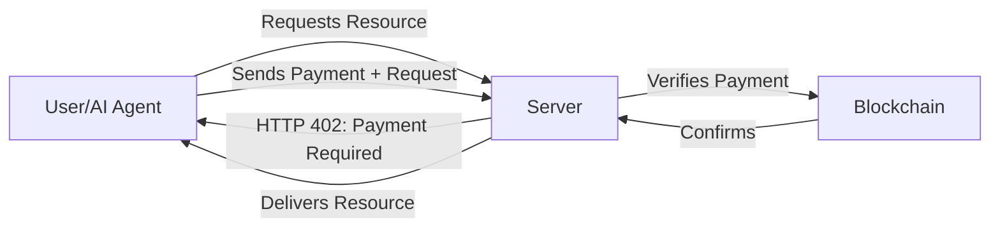

***

## Why X402 Matters

### The Problem X402 Solves

#### Traditional Payment Systems Are Broken for the Internet:

1. **High Fees**&#x20;
   * Credit cards charge 2-3% + $0.30 per transaction
   * Makes small payments ($0.01 - $1.00) impossible
2. **Slow Settlement**&#x20;
   * Payments take 2-3 business days to settle
   * Merchants wait to receive money
3. **Account Friction**&#x20;
   * Every service requires creating an account
   * Sharing personal information repeatedly
   * Managing passwords and API keys
4. **Not Built for Machines**&#x20;
   * AI agents can't autonomously pay for services
   * No programmatic payment flow

### The X402 Solution

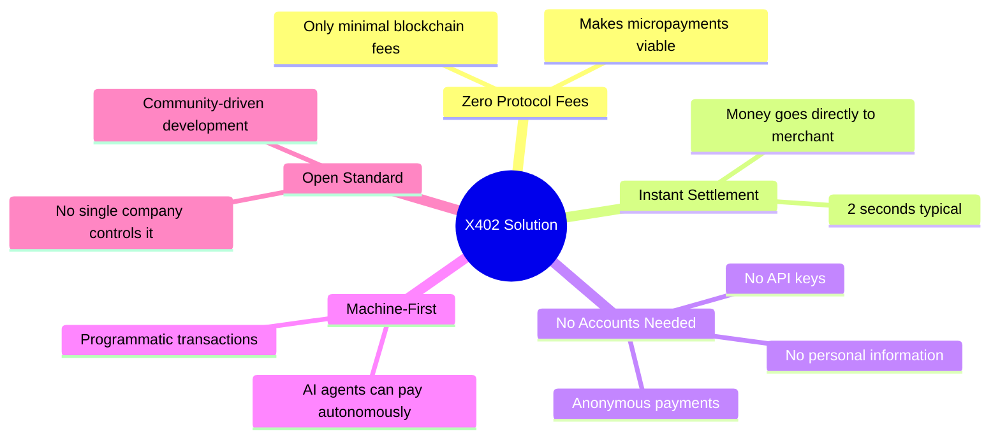

***

## How X402 Works

### The Payment Flow (Simple Version)



### Initial request / Access attempt

You knock on a door (request a resource).



### Server demands payment

The door says "That'll be $0.10" (Server responds with 402 Payment Required).



### Client pays

You slide money under the door (Client sends payment authorization).



### Server verifies and serves

The door verifies the money and opens (Server verifies payment and delivers content).



### The Technical Flow

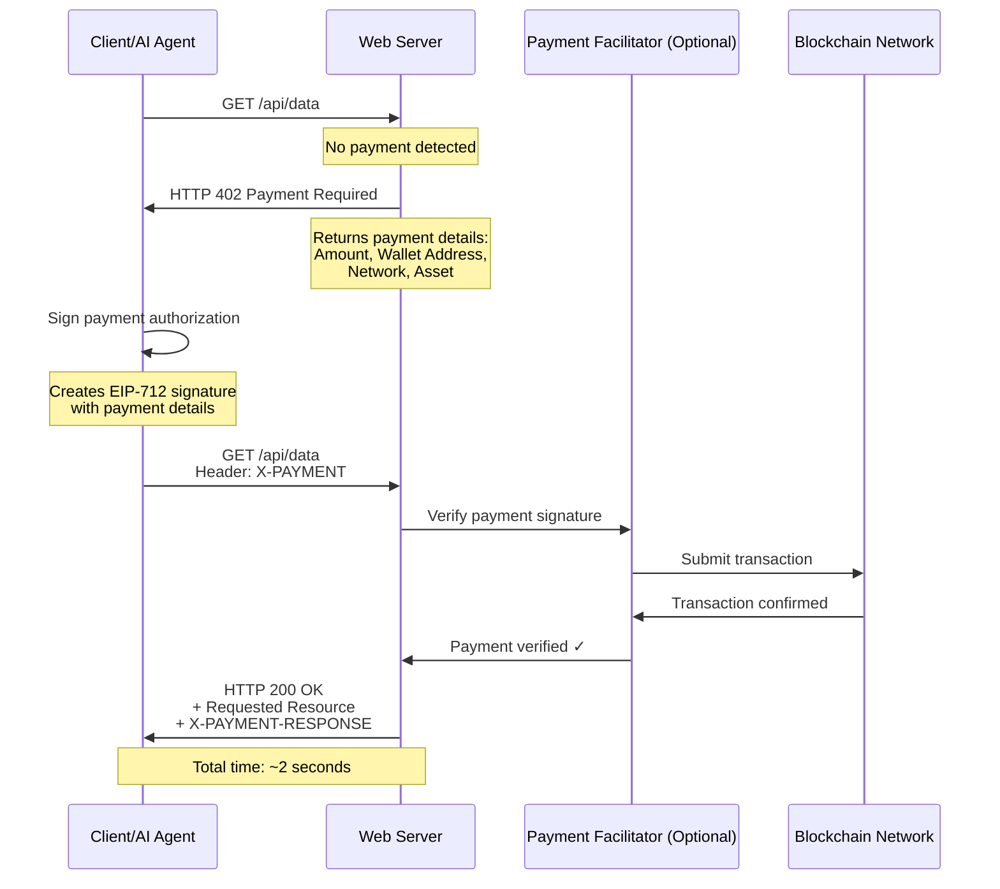

### Step-by-Step Breakdown



### Initial Request (No Payment)

Example request:

```http
GET /api/premium-data HTTP/1.1
Host: example.com
```

Server receives a request with no payment present.



### Server Responds with Payment Requirement

Server responds with HTTP 402 and payment details. Example:

```http
HTTP/1.1 402 Payment Required
Content-Type: application/json

{
  "maxAmountRequired": "0.10",
  "resource": "/api/premium-data",
  "description": "Access requires payment",
  "payTo": "0xABCD...1234",
  "asset": "0xA0b8...EB48",
  "network": "base-mainnet",
  "facilitator": "https://x402.org/facilitator"
}
```



### Client Sends Payment Authorization

Client signs a payment authorization and includes it in the request header. Example:

```http
GET /api/premium-data HTTP/1.1
Host: example.com
X-PAYMENT: {
  "scheme": "exact",
  "version": "1.0",
  "data": {
    "signature": "0x1234...",
    "validAfter": "1234567890",
    "validBefore": "1234567899",
    ...
  }
}
```

The signature typically uses EIP-712 structured data signing.



### Server Returns Resource with Payment Confirmation

After verification, server responds with 200 OK and payment confirmation metadata:

```http
HTTP/1.1 200 OK
X-PAYMENT-RESPONSE: {
  "transactionHash": "0xabc...def",
  "blockNumber": "12345678",
  "status": "confirmed"
}

{
  "data": "Your premium content here..."
}
```



***

## Key Features

### 1. **Zero Protocol Fees**

* X402 itself charges **nothing**
* Only blockchain transaction fees apply (typically $0.01 or less on Layer 2 networks)
* Makes micropayments economically viable

### 2. **2-Second Settlement**

* Payments confirm in approximately 2 seconds
* Compare to 2-3 days for traditional payments
* Instant access to funds for merchants

### 3. **Chain Agnostic**

* Works with any blockchain network
* Currently supports Ethereum, Base, Polygon, and more
* Extensible to new chains through community contributions

### 4. **HTTP Native**

* Builds on existing HTTP standards
* No special infrastructure required
* Works with any programming language or framework

### 5. **Privacy-Focused**

* No account creation required
* No personal information needed
* Anonymous payments possible

### 6. **AI-Ready**

* Designed for autonomous AI agents
* Programmatic payment flows
* Machine-to-machine transactions

### Feature Comparison Chart

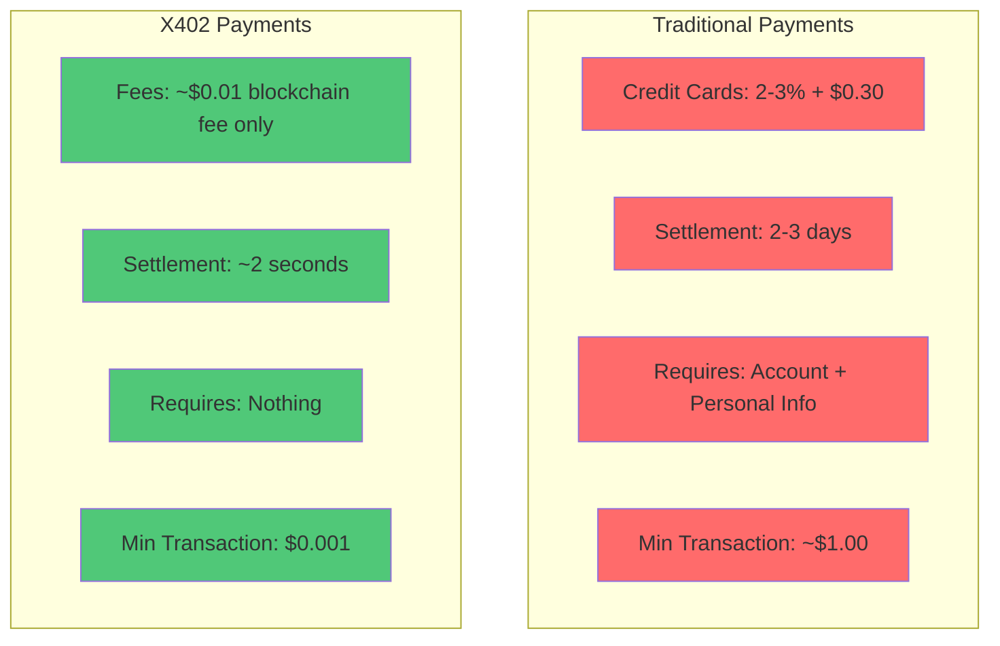

***

## Technical Architecture

### Core Components

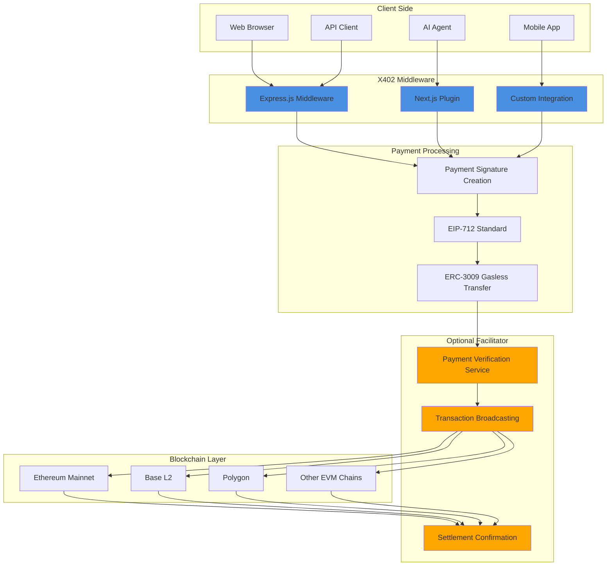

### Payment Schemes

X402 supports different payment models through extensible "schemes":

#### Exact Scheme (Currently Available)

* Pay a specific, fixed amount (e.g., "$0.10 to read this article")
* Use case: One-time access, fixed-price APIs

#### Up To Scheme (Proposed)

* Pay up to a maximum amount based on usage (e.g., "Up to $1.00 for API computation time")
* Use case: Variable compute, token generation, streaming data

#### Deferred Scheme (Recently Proposed by Cloudflare)

* Aggregate multiple small payments into one transaction and settle later (hourly, daily, etc.)
* Use case: High-frequency micro-transactions, web crawling

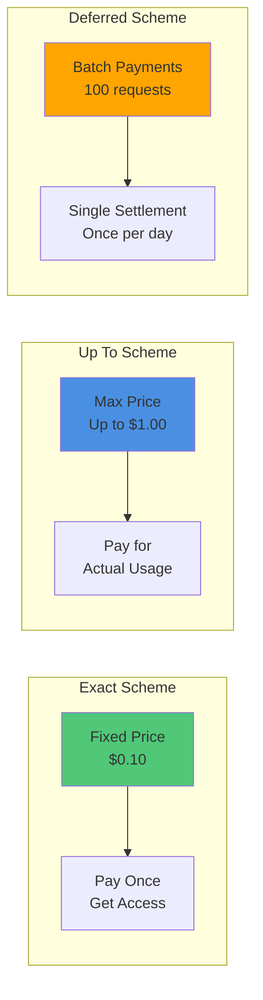

### Security Model

X402 uses industry-standard cryptographic methods:

1. **EIP-712 Signatures** - Structured data signing for clear wallet interfaces
2. **ERC-3009 Gasless Transfers** - Users don't need ETH for gas fees
3. **Trust-Minimizing** - No intermediary can move funds without authorization
4. **Open Source** - Community-audited code for transparency

***

## Use Cases

### 1. AI Agent Payments&#x20;

Scenario: An AI research assistant needs to gather data from multiple premium sources.

With X402:

* AI agent autonomously discovers services with X402
* Pays $0.10 per API call as needed
* No accounts, no API keys, no human intervention
* Example total for occasional usage: $5-20/month

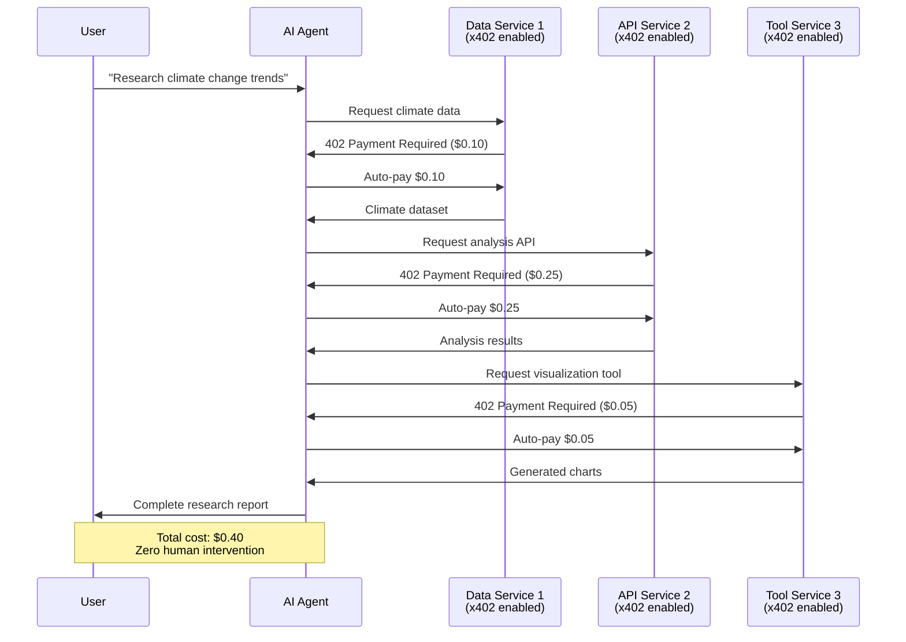

### 2. Content Monetization&#x20;

For publishers:

* Charge per article ($0.05-0.50) instead of monthly subscriptions
* No paywall account creation friction
* Instant revenue

For readers:

* Only pay for what you read
* No subscriptions to manage
* Anonymous access

### 3. API Monetization&#x20;

Old model:

* Free tier abused; paid tiers are monthly subscriptions

X402 model:

* Pay per request ($0.001-0.10 per call)
* No free tier abuse
* Fair pricing for all users

### 4. Web Crawling & Data Access&#x20;

Problem: Bots and scrapers consume resources without compensation.

Solution:

* Charge crawlers per page ($0.01)
* Legitimate bots pay automatically; bad actors discouraged
* Website owners monetize content

### 5. Compute & Storage Services&#x20;

Pay-per-use model for:

* GPU compute time
* Storage access
* Database queries
* Image processing
* AI model inference

***

## Infrastructure & Providers

### Core Infrastructure

#### 1. Coinbase (Protocol Creator)

* Role: Original developer and sponsor of X402
* Contribution: Created initial protocol spec, reference implementations, facilitator at x402.org
* Website: https://www.coinbase.com/developer-platform

#### 2. Cloudflare (Major Backer)

* Role: Infrastructure provider and co-founder of x402 Foundation
* Contribution: Edge integration, Agents SDK, MCP integration, proposed deferred scheme
* Announcement: July 2025 - Full backing and integration
* Website: https://www.cloudflare.com

#### 3. X402 Foundation (Governance)

* Role: Neutral governing body founded July 2025 by Coinbase and Cloudflare
* Purpose: Maintain spec, coordinate contributions, promote adoption

### Payment Facilitators

Facilitators help verify payments and broadcast transactions:

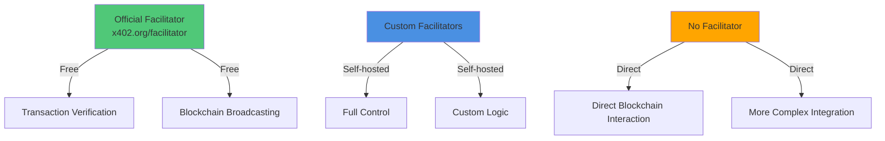

### Blockchain Networks Supported

X402 is chain-agnostic but commonly used on:

| Network              | Type        | Typical Fee | Settlement Time |
| -------------------- | ----------- | ----------- | --------------- |
| **Base**             | Ethereum L2 | \~$0.01     | 2 seconds       |
| **Polygon**          | Ethereum L2 | \~$0.01     | 2 seconds       |
| **Ethereum Mainnet** | L1          | $1-5        | 12-15 seconds   |
| **Arbitrum**         | Ethereum L2 | \~$0.02     | 2 seconds       |
| **Optimism**         | Ethereum L2 | \~$0.02     | 2 seconds       |
| Somnia               | L1          | \~0.01      | >1s             |

### Developer Tools & Libraries


### Platform Integrations

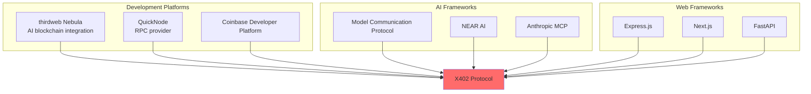

***

## Deep Dive: Infrastructure Providers

### 1. thirdweb - The Developer Platform Champion

thirdweb provides SDKs, APIs, and tools to build blockchain apps. Their X402 features include:

* One-line integration helper `wrapFetchWithPayment` to handle 402 responses
* Multi-chain support (example states support across many chains)
* Flexible payment options (any ERC20 token)
* Built-in facilitator service
* Interactive playground at playground.thirdweb.com/payments/x402

Example usage:

```javascript
import { wrapFetchWithPayment } from "thirdweb/x402";

const fetchWithPay = wrapFetchWithPayment(fetch, client, wallet);
const response = await fetchWithPay("https://api.example.com/data");
```

Key improvements: waitUntil option, automatic signature type detection, revamped filtering API.

### 2. QuickNode - The RPC Infrastructure Powerhouse

QuickNode provides high-performance RPC endpoints across many blockchains, supporting X402 apps with reliable connectivity, Streams, Functions, and webhooks to help monitor and verify payments quickly.

Performance: 99.95% uptime SLA, global coverage.

### 3. Chainlink - The Oracle Network Bridge

Chainlink provides decentralized oracles, CCIP cross-chain messaging, and AI integration capabilities relevant to X402 for aggregating/validating data, multi-model aggregation, and cross-chain settlements.

### 4. Coinbase Developer Platform (CDP) - The Official Facilitator

CDP hosts the primary X402 facilitator, offering fee-free USDC settlement on Base mainnet. Facilitator responsibilities:

* Validate EIP-712 signatures
* Broadcast transactions (ERC-3009 gasless transfers)
* Return transaction hashes and confirmations

Architecture example shown in sequence diagram in original content.

### 5. Other Key Infrastructure Players

* NEAR AI — agent commerce platform using X402
* Anthropic MCP — X402 integration enabling model payments
* Boosty Labs — real-time data purchases
* Zyte.com — web scraping marketplace with X402
* Apexti Toolbelt — 1500+ Web3 APIs integrated with X402

### Infrastructure Comparison Matrix

| Provider         | Primary Role        | X402 Integration               | Best For                          |
| ---------------- | ------------------- | ------------------------------ | --------------------------------- |
| **thirdweb**     | Developer Platform  | Direct (SDK + Middleware)      | Quick integration, AI agents      |
| **QuickNode**    | RPC Infrastructure  | Supporting (Blockchain access) | Enterprise apps, high traffic     |
| **Chainlink**    | Oracle Network      | Future (AI + Cross-chain)      | Multi-chain apps, AI verification |
| **Coinbase CDP** | Facilitator Service | Official (Payment processing)  | Base network, low fees            |
| **NEAR AI**      | AI Marketplace      | Direct (Agent commerce)        | AI-to-AI transactions             |
| **Anthropic**    | AI Platform         | Direct (MCP integration)       | AI model payments                 |

***

## Implementation Guide

### For Developers: Adding X402 to Your Service

#### Basic Implementation (Express.js)



### Install the middleware

```bash
npm install x402-express dotenv
```



### Add to your server (Just 1 line!)

Example Express.js integration:

```javascript
import express from 'express';
import { paymentMiddleware } from 'x402-express';

const app = express();

// Single line to enable X402 payments!
app.use(
  paymentMiddleware(
    "0xYourWalletAddress",
    {
      "GET /api/premium-data": { price: "$0.10", network: "base-mainnet" },
      "POST /api/ai-service": { price: "$0.50", network: "base-mainnet" }
    },
    { url: "https://x402.org/facilitator" }
  )
);

// Your regular endpoints
app.get('/api/premium-data', (req, res) => {
  res.json({ data: "Premium content here!" });
});

app.listen(3000);
```

That's it — your API now requires payment.



### For Non-Developers: What You Need to Know

As a Service Provider (Merchant)

1. Get a crypto wallet - Use Coinbase Wallet, MetaMask, or similar
2. Get some testnet tokens - For testing on Base Sepolia
3. Hire a developer - Show them this guide
4. Set your prices - Decide what each service costs
5. Deploy - Go live and start earning

As a Service Consumer (User/AI Agent)

1. Get a crypto wallet with USDC
2. Use X402-enabled clients - Many AI agents support this automatically
3. Browse services - No account needed
4. Pay as you go - Automatic micropayments

### Integration Checklist

```mermaid
graph LR
    A[✓ Crypto Wallet] --> B[✓ Testnet Tokens]
    B --> C[✓ Install Middleware]
    C --> D[✓ Configure Endpoints]
    D --> E[✓ Test Payments]
    E --> F[✓ Deploy to Mainnet]
    F --> G[✓ Monitor Transactions]
    
    style A fill:#50C878
    style B fill:#50C878
    style C fill:#50C878
    style D fill:#50C878
    style E fill:#50C878
    style F fill:#50C878
    style G fill:#50C878
```

***

## The Future of X402

### Current Status (October 2025)

* Protocol specification v1.0 released
* Reference implementations available
* &#x20;Major infrastructure backing (Coinbase, Cloudflare)
* &#x20;X402 Foundation established
* &#x20;Growing ecosystem of adopters
* &#x20;Deferred payment scheme in development
* &#x20;Additional payment schemes being proposed

### Roadmap

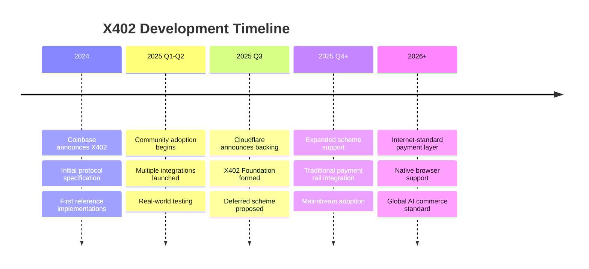

### Vision: The Internet's Native Payment Layer

X402 aims to become as fundamental to the internet as HTTP, DNS, and TLS/SSL — making payments as seamless as loading a webpage.

***

## Key Takeaways

### For Everyone

1. X402 is like a "pay-per-use" system for the internet - no subscriptions, no accounts
2. It's instant - payments settle in \~2 seconds
3. It's cheap - only \~$0.01 blockchain fee, no percentage fees
4. It's open - anyone can use or build on it
5. It's designed for AI - machines can pay autonomously

### For Developers

1. Dead simple to integrate - often just 1 line of middleware
2. Works with existing code - no major refactoring needed
3. Chain agnostic - choose your preferred blockchain
4. Open source - Apache 2.0 license, community-driven
5. Enterprise backing - Coinbase and Cloudflare support

### For Business Owners

1. New revenue model - monetize per-use instead of subscriptions
2. No payment processor fees - save 2-3% on every transaction
3. Instant settlement - better cash flow
4. Global reach - no geographic payment restrictions
5. Future-proof - ready for the AI economy

***

## Resources

### Official Links

* Protocol Website: https://www.x402.org
* Documentation: https://x402.gitbook.io/x402
* GitHub Repository: https://github.com/coinbase/x402
* Whitepaper: https://www.x402.org/x402-whitepaper.pdf
* Coinbase Developer Platform: https://www.coinbase.com/developer-platform

### Developer Resources

* QuickNode Guide: https://www.quicknode.com/guides/infrastructure/how-to-use-x402-payment-required
* Express.js Middleware: npm package `x402-express`
* Client Library: npm package `x402-client`

### Infrastructure Providers

* Facilitator Service: https://x402.org/facilitator
* Cloudflare Integration: https://blog.cloudflare.com/x402/
* thirdweb Nebula: https://blog.thirdweb.com/what-is-x402-protocol

### Community

* GitHub Discussions: https://github.com/coinbase/x402/discussions
* Protocol Contributions: See CONTRIBUTING.md in the GitHub repo
* Cloudflare Contact: x402@cloudflare.com

***

## Glossary

| Term               | Definition                                                                            |
| ------------------ | ------------------------------------------------------------------------------------- |
| **HTTP 402**       | A rarely-used HTTP status code meaning "Payment Required" - now activated by X402     |
| **Stablecoin**     | A cryptocurrency pegged to a stable asset (e.g., USDC = $1 USD)                       |
| **Layer 2 (L2)**   | A secondary blockchain network built on Ethereum for faster, cheaper transactions     |
| **EIP-712**        | Ethereum standard for signing structured data in a human-readable way                 |
| **ERC-3009**       | Standard enabling gasless token transfers (user doesn't pay gas fees)                 |
| **Facilitator**    | Optional service that helps verify payments and broadcast to blockchain               |
| **Micropayment**   | Very small payment (e.g., $0.001 - $1.00) that's impractical with traditional systems |
| **Chain Agnostic** | Works with any blockchain network, not tied to one                                    |
| **Middleware**     | Software that sits between your application and incoming requests                     |
| **Base**           | Ethereum Layer 2 network built by Coinbase, optimized for low fees                    |
| **USDC**           | USD Coin, a stablecoin worth $1, commonly used with X402                              |

***

## FAQs

<details>

<summary>Do I need cryptocurrency to use X402?</summary>

A: As a user, yes - you need a small amount of stablecoin (like USDC) to pay. As a merchant, you receive stablecoins which you can convert to regular currency.

</details>

<details>

<summary>Is this only for crypto people?</summary>

A: No! The goal is to make it invisible. Users just see "Pay $0.10" and click - the crypto happens in the background.

</details>

<details>

<summary>What about credit cards?</summary>

A: Future versions of X402 may support traditional payment rails, but currently it's crypto-based for speed and low fees.

</details>

<details>

<summary>Can my AI assistant use this?</summary>

A: Yes! That's a primary use case. AI agents can autonomously pay for services using X402.

</details>

<details>

<summary>How much does it cost?</summary>

A: The protocol itself is free. You only pay blockchain transaction fees (\~$0.01) and the price the merchant sets.

</details>

<details>

<summary>Is it secure?</summary>

A: Yes. It uses industry-standard cryptography (EIP-712, ERC-3009) and is open source for community auditing.

</details>

<details>

<summary>Who controls X402?</summary>

A: No single entity. It's governed by the X402 Foundation (Coinbase + Cloudflare + community).

</details>

***

## Conclusion

X402 represents a fundamental shift in how the internet handles payments. By making transactions as simple as HTTP requests, it enables:

* True micropayments previously impossible
* Autonomous AI commerce without human intervention
* Fair creator monetization without platform fees
* Instant global payments with no geographic barriers

Whether you're a developer looking to monetize your API, a business exploring new revenue models, or simply curious about the future of internet payments, X402 offers a glimpse into a more efficient, open, and automated digital economy.

The internet is getting its native payment layer  and it's built on open standards.

***
