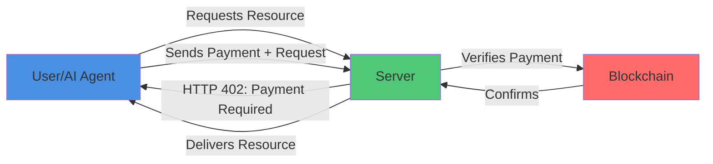
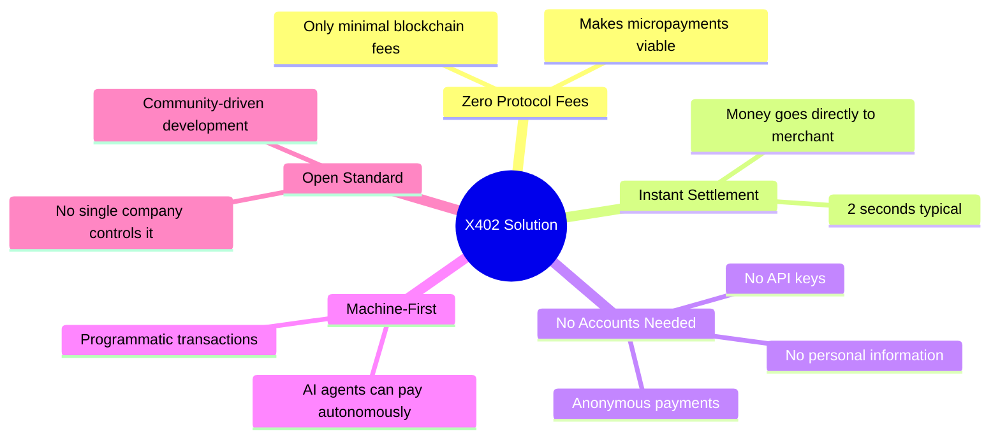
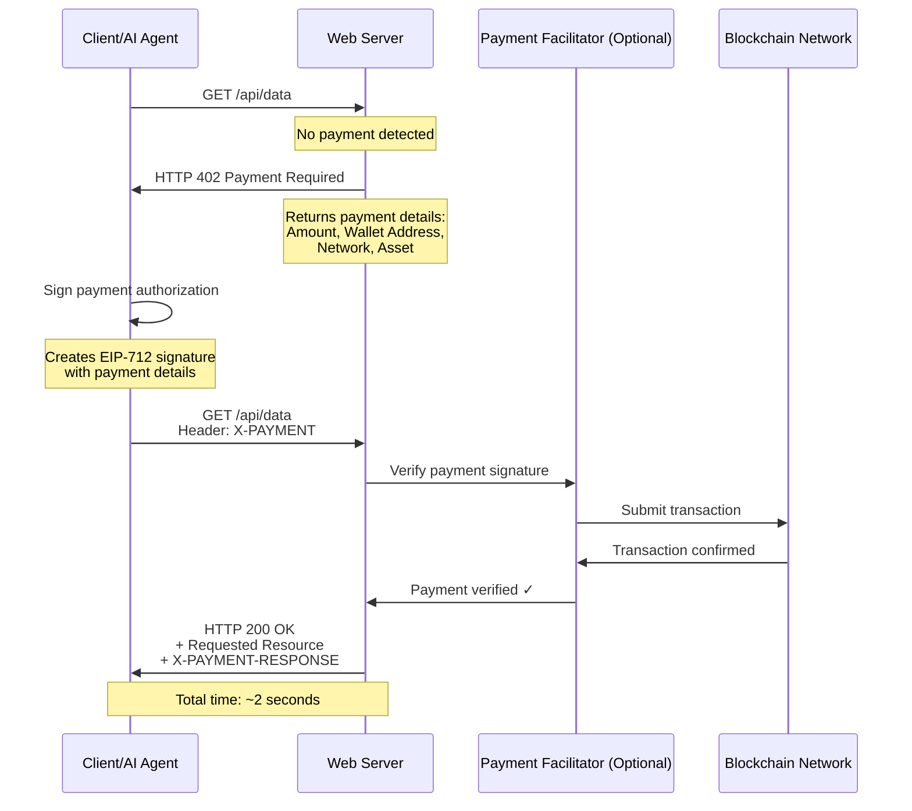
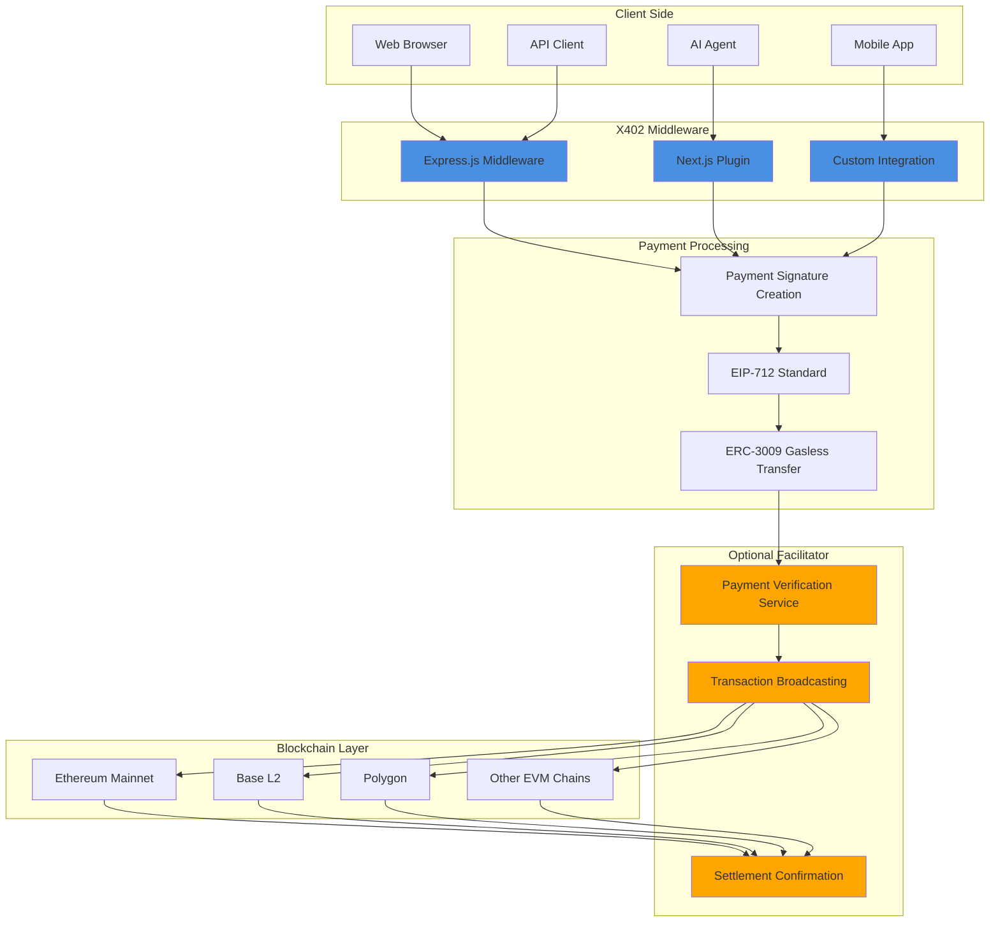
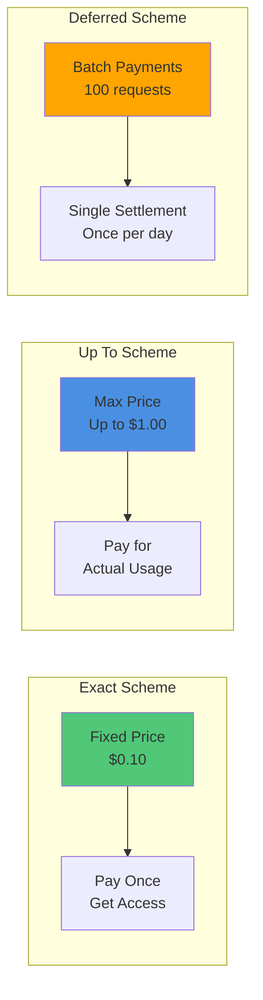

# x402\_gitbook\_guide

## What is X402?

**In Simple Terms:** X402 is like a "pay-per-use" vending machine for the internet. Instead of subscribing to services or creating accounts, you pay small amounts (micropayments) instantly to access what you need — like paying for a single API call, reading one article, or getting one piece of data.

**Technical Definition:** X402 is an open-source, chain-agnostic payment protocol built on top of HTTP that activates the long-dormant HTTP status code **402 "Payment Required"** to enable instant, frictionless payments for web resources using blockchain technology (primarily stablecoins like USDC).

### Visual Overview



## Why X402 Matters

### The Problem X402 Solves

Traditional payment systems are not well suited for internet-native micropayments:

* High fees (credit cards charge 2–3% + $0.30)
* Slow settlement (2–3 business days)
* Account friction (accounts, repeated personal info, API keys)
* Not built for machines (AI agents cannot autonomously pay)

### The X402 Solution

* Zero protocol fees (only blockchain fees)
* Instant settlement (\~2 seconds)
* No accounts required (anonymous payments possible)
* Machine-first (AI agents can pay autonomously)
* Open standard (community-driven)



## How X402 Works

### The Payment Flow (Simple Version)

Think of it like this:

* You knock on a door (Request a resource)
* The door says "That'll be $0.10" (Server responds with 402 Payment Required)
* You slide money under the door (Client sends payment authorization)
* The door verifies the money and opens (Server verifies payment and delivers content)

### The Technical Flow



### Step-by-Step Breakdown



### Initial Request (No Payment)

Example request:

```http
GET /api/premium-data HTTP/1.1
Host: example.com
```

The server detects no payment and responds with HTTP 402.



### Server Responds with Payment Requirement

Example response:

```http
HTTP/1.1 402 Payment Required
Content-Type: application/json

{
  "maxAmountRequired": "0.10",
  "resource": "/api/premium-data",
  "description": "Access requires payment",
  "payTo": "0xABCD...1234",
  "asset": "0xA0b8...EB48",
  "network": "base-mainnet",
  "facilitator": "https://x402.org/facilitator"
}
```

The response includes amount, recipient, asset, network, and optional facilitator.



### Client Sends Payment Authorization

Client signs a payment authorization (e.g., EIP-712) and includes it in the request header:

```http
GET /api/premium-data HTTP/1.1
Host: example.com
X-PAYMENT: {
  "scheme": "exact",
  "version": "1.0",
  "data": {
    "signature": "0x1234...",
    "validAfter": "1234567890",
    "validBefore": "1234567899",
    ...
  }
}
```



### Server Verifies & Returns Resource

Once payment is verified (potentially via a facilitator broadcasting to the blockchain), server returns:

```http
HTTP/1.1 200 OK
X-PAYMENT-RESPONSE: {
  "transactionHash": "0xabc...def",
  "blockNumber": "12345678",
  "status": "confirmed"
}

{
  "data": "Your premium content here..."
}
```

Total time is typically \~2 seconds.



## Key Features

* Zero Protocol Fees: X402 charges nothing; only blockchain fees apply.
* 2-Second Settlement: Fast confirmation compared to traditional payments.
* Chain Agnostic: Works with any blockchain network.
* HTTP Native: Uses standard HTTP semantics (402 Payment Required).
* Privacy-Focused: No account creation or PII required.
* AI-Ready: Designed for autonomous, programmatic payments.

Feature comparison and visual charts in original spec illustrate these differences.

## Technical Architecture

### Core Components



### Payment Schemes

X402 supports extensible schemes. Examples:

* Exact Scheme: fixed amount (e.g., $0.10)
* Up To Scheme: pay up to a maximum based on usage
* Deferred Scheme: aggregate many small payments into batch settlements



### Security Model

* EIP-712 Signatures for structured data signing
* ERC-3009 Gasless Transfers to avoid requiring ETH for gas
* Trust-minimizing: no intermediary can move funds without authorization
* Open source for community auditing

## Use Cases

* AI agent payments: autonomous agents pay per API call or tool access
* Content monetization: pay-per-article instead of subscriptions
* API monetization: pay-per-request pricing
* Web crawling & data access: charge crawlers per page
* Compute & storage services: pay-for-usage (GPU, storage, inference)

Real-world integrations and ecosystem participants are noted in the original spec.

## Infrastructure & Providers

### Core Infrastructure

* Coinbase (Protocol Creator): https://www.coinbase.com/developer-platform
* Cloudflare (Major Backer): https://www.cloudflare.com
* X402 Foundation (Governance) — established July 2025

### Payment Facilitators

Facilitators are optional services to verify payments and broadcast transactions. Official facilitator: https://x402.org/facilitator

### Blockchain Networks Supported

Commonly used networks include Base, Polygon, Ethereum Mainnet, Arbitrum, Optimism. Base is highlighted as most popular for low fees and fast settlement.

### Developer Tools & Libraries

Official libraries (npm packages shown in original content):

```bash
npm install x402-express    # Express.js middleware
npm install x402-client     # JavaScript/TypeScript client
npm install x402-react      # React hooks
```

Language support: JavaScript/TypeScript (full), Python/Go community libraries, Rust in development, and any HTTP-capable language can implement from the spec.

## Implementation Guide

### For Developers: Adding X402 to Your Service

Basic Implementation (Express.js)



### Install the middleware

```bash
npm install x402-express dotenv
```



### Add to your server (1 line to enable)

```javascript
import express from 'express';
import { paymentMiddleware } from 'x402-express';

const app = express();

// Single line to enable X402 payments!
app.use(
  paymentMiddleware(
    "0xYourWalletAddress",
    {
      "GET /api/premium-data": { price: "$0.10", network: "base-mainnet" },
      "POST /api/ai-service": { price: "$0.50", network: "base-mainnet" }
    },
    { url: "https://x402.org/facilitator" }
  )
);

// Your regular endpoints
app.get('/api/premium-data', (req, res) => {
  res.json({ data: "Premium content here!" });
});

app.listen(3000);
```

That's it — your API now requires payment.



### For Non-Developers: What You Need to Know

As a Service Provider (Merchant):

1. Get a crypto wallet (Coinbase Wallet, MetaMask, etc.)
2. Get some testnet tokens for testing (Base Sepolia, etc.)
3. Hire a developer and share this guide
4. Set your prices
5. Deploy and start earning

As a Service Consumer (User/AI Agent):

1. Get a crypto wallet with USDC
2. Use X402-enabled clients (many AI agents support this)
3. Browse services (no account needed)
4. Pay as you go — automatic micropayments

### Integration Checklist

```mermaid
graph LR
    A[✓ Crypto Wallet] --> B[✓ Testnet Tokens]
    B --> C[✓ Install Middleware]
    C --> D[✓ Configure Endpoints]
    D --> E[✓ Test Payments]
    E --> F[✓ Deploy to Mainnet]
    F --> G[✓ Monitor Transactions]
    
    style A fill:#50C878
    style B fill:#50C878
    style C fill:#50C878
    style D fill:#50C878
    style E fill:#50C878
    style F fill:#50C878
    style G fill:#50C878
```



## The Future of X402

### Current Status (October 2025)

* Protocol v1.0 released
* Reference implementations available
* Major backing from Coinbase and Cloudflare
* X402 Foundation established
* Deferred payment scheme and additional schemes in development

Roadmap outlines expansion of scheme support, integration with traditional payment rails, and broader adoption.

### Vision

X402 aims to become a native payment layer for the internet — as fundamental as HTTP, DNS, and TLS — enabling seamless micropayments, autonomous AI commerce, and new business models.

## Key Takeaways

* X402 is pay-per-use for the internet (no subscriptions, no accounts)
* Fast: payments settle in \~2 seconds
* Cheap: only blockchain fees (\~$0.01 on L2s)
* Open and chain-agnostic
* Designed for machine-to-machine autonomous payments
* Simple to integrate for developers (often one middleware line)

## Resources

Official Links:

* Protocol Website: https://www.x402.org
* Documentation: https://x402.gitbook.io/x402
* GitHub Repository: https://github.com/coinbase/x402
* Whitepaper: https://www.x402.org/x402-whitepaper.pdf
* Coinbase Developer Platform: https://www.coinbase.com/developer-platform

Developer resources and infrastructure provider links are listed in the original content (including QuickNode, Cloudflare, thirdweb Nebula).

Community:

* GitHub Discussions: https://github.com/coinbase/x402/discussions
* Contributions: See CONTRIBUTING.md in the GitHub repo
* Cloudflare Contact: x402@cloudflare.com

## Glossary

| Term           | Definition                                                                        |
| -------------- | --------------------------------------------------------------------------------- |
| HTTP 402       | A rarely-used HTTP status code meaning "Payment Required" - now activated by X402 |
| Stablecoin     | A cryptocurrency pegged to a stable asset (e.g., USDC = $1 USD)                   |
| Layer 2 (L2)   | A secondary blockchain network built on Ethereum for faster, cheaper transactions |
| EIP-712        | Ethereum standard for signing structured data in a human-readable way             |
| ERC-3009       | Standard enabling gasless token transfers (user doesn't pay gas fees)             |
| Facilitator    | Optional service that helps verify payments and broadcast to blockchain           |
| Micropayment   | Very small payment (e.g., $0.001 - $1.00)                                         |
| Chain Agnostic | Works with any blockchain network                                                 |
| Middleware     | Software that sits between your application and incoming requests                 |
| Base           | Ethereum Layer 2 network built by Coinbase                                        |
| USDC           | USD Coin, a stablecoin commonly used with X402                                    |

## FAQs

<details>

<summary>Do I need cryptocurrency to use X402?</summary>

As a user, yes — you need a small amount of stablecoin (like USDC) to pay. As a merchant, you receive stablecoins which you can convert to regular currency.

</details>

<details>

<summary>Is this only for crypto people?</summary>

No. The goal is to make it invisible to end users. Users should see a simple "Pay $0.10" and click — the crypto happens in the background.

</details>

<details>

<summary>What about credit cards?</summary>

Future versions of X402 may support traditional payment rails, but currently it's crypto-based for speed and low fees.

</details>

<details>

<summary>Can my AI assistant use this?</summary>

Yes. Enabling AI agents to autonomously pay for services is a primary use case.

</details>

<details>

<summary>How much does it cost?</summary>

The protocol itself is free. You only pay blockchain transaction fees (typically \~$0.01 on L2s) and whatever price the merchant sets.

</details>

<details>

<summary>Is it secure?</summary>

Yes. X402 uses industry-standard cryptography (EIP-712, ERC-3009) and open-source code for community auditing.

</details>

<details>

<summary>Who controls X402?</summary>

Governance is handled by the X402 Foundation (Coinbase + Cloudflare + community). The protocol is intended to be open and neutral.

</details>

## Conclusion

X402 represents a shift toward native, internet-scale micropayments: autonomous AI commerce, fair creator monetization, instant global payments, and pay-per-use monetization models. It enables payments to be as seamless as loading a webpage.

Document Version: 1.0\
Last Updated: October 2025\
License: Apache 2.0 (Open Source)
